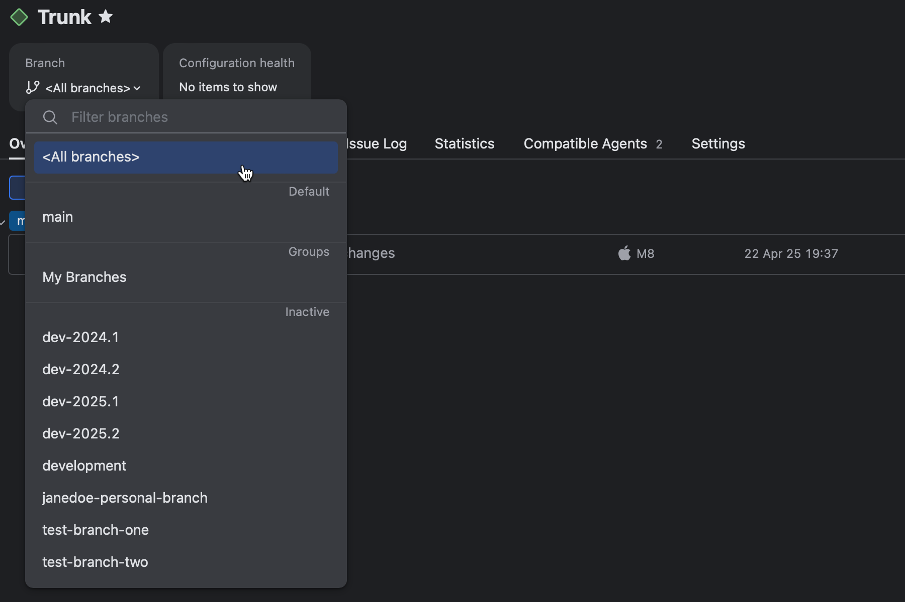
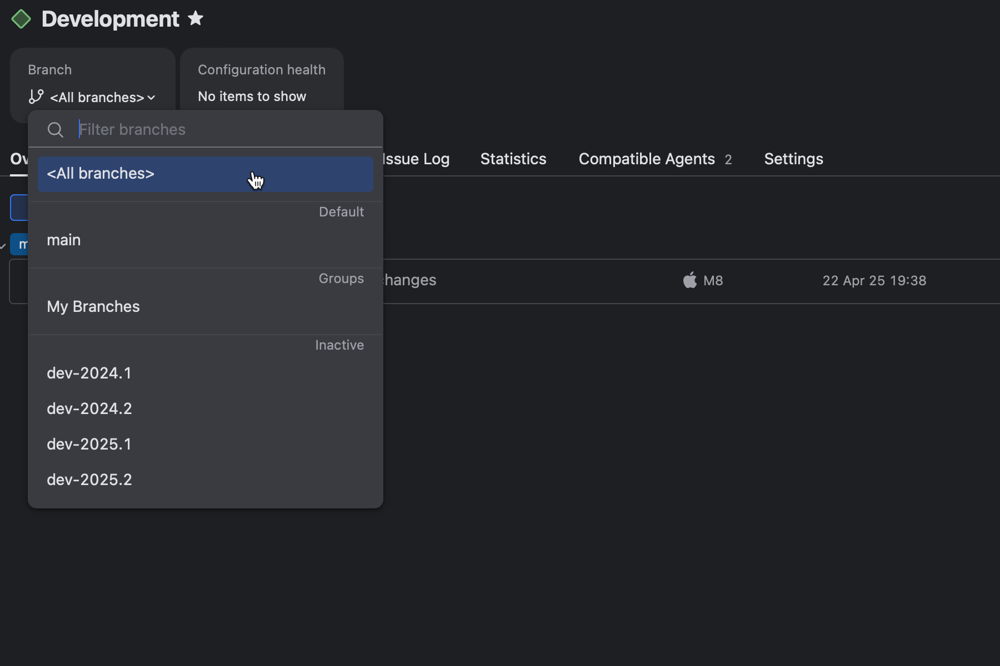

# TeamCity Samples: Core Concepts

This repository includes bite-sized samples that demonstrate main TeamCity concepts.

## Table of Contents


* [How to Test These Samples](#how-to-test-these-samples)
* [Sample 1 — Basic TeamCity Objects](#sample-1--basic-teamcity-objects)
* [Sample 2 — Build Configuration Templates](#sample-2--build-configuration-templates)
* [Sample 3 — Input Parameters](#sample-3--input-parameters)
* [Sample 4 — Build Artifacts](#sample-4--build-artifacts)
* [Sample 5 — Feature Branches and Branch Filters](#sample-5--feature-branches-and-branch-filters)
* [Sample 6 — Artifact Dependencies](#sample-6--artifact-dependencies)
  

## How to Test These Samples

TBD


## Sample 1 — Basic TeamCity Objects

Demonstrates a hierarchy of core TeamCity entities:

```
Main Project
├── Sub-Project A
│   └── Sub-project Build Configuration
│       └── Build Step (CLI)
└── Build Configuration 1: Hello World
        └── Build Step (CLI)
```

* A **build step** is the elemental block of any building routine. Encapsulates an action (or a series of actions) that cannot be executed partially.
* A **build configuration** is a collection of sequentially executed steps. Each step can have its own run conditions, so you can control which steps to execute depending on required conditions.
* A **project** is a home for build configurations and other sub-projects. Cannot perform any CI/CD routines and allows you to group/categorize builds on your server.

Related help articles: [Project Administrator Guide](https://www.jetbrains.com/help/teamcity/project-administrator-guide.html#Steps%2C+Configurations+and+Projects)

## Sample 2 — Build Configuration Templates

Templates allow you to pre-set every new build configuration according to your requirements. In this sample:

* **Source Configuration** — a manually created configuration. Includes one build step, a parameter, a VCS trigger, and the "Build Approval" build feature.
* **Sample Template** — extracted from **Source Configuration** via "Configuration settings | Quick Actions | Extract template..." menu action. After the template was extracted, it automatically applies to its parent configuration (in Kotlin DSL, note the configuration has no unique settings except for description and name: all settings were moved to the extracted template).
* **Templated Build Configuration** — a configuration whose "based on template" property was set upon creation. Inherits all settings of a template, but adds one additional build step and overrides the default parameter value. This technique allows you to quickly "clone" a default build configuration, and then customize it as needed.

You can stop synchronizing a templated configuration with its parent parent template at any time. To do so, go to "Configuration settings | Quick Actions" and select "Detach from template...".

A template can be designated as the default for a project, ensuring that all new configurations automatically follow its structure and settings.

Related help articles: [Build Configuration Template](https://www.jetbrains.com/help/teamcity/build-configuration-template.html)

## Sample 3 — Input Parameters

TeamCity parameters are name-value pairs. Parameters can be input (designed to be used directly in the configuration/project that declares them) and output (can be referenced by downstream configurations of a build chain).

Depending on their origin, parameters can be custom (user-defined) and predefined. TeamCity exposes a wide range of predefined build parameters that return the build number, the build agent OS type, the user who triggered the build, and so on.

This sample performs two steps:

1. Merges values of the custom `greeting.string` and predefined `teamcity.build.triggeredBy.username` parameters. The result is written to a custom `output.string` parameter via the `##teamcity[setParameter name='name' value='value']` service message.
2. Prints the `output.string` parameter value to the build log.

> Note: You cannot get the modified parameter value in the same step that sent the `##teamcity[setParameter]` message. For that reason, reporting the `output.string` parameter value is done as a separate step.

Related help articles: [Build Parameters](https://www.jetbrains.com/help/teamcity/configuring-build-parameters.html) | [Custom parameters](https://www.jetbrains.com/help/teamcity/typed-parameters.html) | [setParameter Service Message](https://www.jetbrains.com/help/teamcity/service-messages.html#set-parameter) 


## Sample 4 — Build Artifacts

Artifacts files that are published by a build if it succeeds. Users can download these files from the **Artifacts** tab of the Build results page. Other TeamCity configurations can import these files via **artifact dependency** relations.

You can publish any files on the agent machine, but normally artifacts are files produced during a build (.jar files, NuGet packages, Docker images, .dll libraries, logs, and so on).

This sample creates three text files in the `<agent_working_directory>/bin/debug" folder. To specify which of them should be published as artifacts, check out the **Artifacts Paths** property of General build configuration settings.

* The `bin/debug/ => results/` expression specifies that TeamCity should publish the entire contents of the `bin/debug` folder. All three files should be organized into a custom `results` directory.
* The `-:bin/debug/ignored.txt` line excludes the one of the files.

TeamCity reads artifact rules one by one, top-down. As a result, two of the three created files will be available on the **Artifacts** tab.

Related help articles: [Build Artifacts](https://www.jetbrains.com/help/teamcity/build-artifact.html) | [Artifact Paths](https://www.jetbrains.com/help/teamcity/configuring-general-settings.html#Artifact+Paths) | [Custom Artifact Storage](https://www.jetbrains.com/help/teamcity/configuring-artifacts-storage.html)


## Sample 5 — Feature Branches and Branch Filters

> This sample uses anonymous connection to the [following GitHub repository](https://github.com/Valrravn/teamcity-multibranch-repo). If you modify VCS root connection and authorization settings, update branch specification and filter branches accordingly.

All TeamCity entities — from build configurations to individual build features — rely on VCS roots to interact with version control systems. A VCS root defines which repository branches are available to the entities that use it. The set of rules determining which branches are monitored is called the **branch specification** and is configured in the root's general settings.

In this sample, the "Main Root" uses the following branch specification, which allows tracking all branches except for `sandbox` and `test`:

```
+:refs/heads/*
-:refs/heads/sandbox
-:refs/heads/test
```

This root is used by two build configurations. The **Trunk** configuration does not make any modifications to the list of available branches, so all branches specified by the root are also available to this build configuration.





The **Development** configuration in turn specfies additional **branch filters**. These filters are applied on top of root branch specifications and allow you to additionally narrow down the list of available branches. These filters are available for many TeamCity entities that communicate with remote repositories: build configurations, triggers, commit status publishers, and so on.

This build configuration filters its branches as follows:

```
-:*
+:<default>
+:dev-*
```

Note that unlike branch specifications that require full branch names (`refs/heads/main`), branch filters require logical branch names (names displayed in TeamCity UI, for example `main` or `<default>`).



The asterisk (`*`) symbol is available in both branch specifications and branch filters, and acts as a wildcard for any sequence of characters.

Related help articles: [Working with Feature Branches](https://www.jetbrains.com/help/teamcity/working-with-feature-branches.html) | [Branch Filter](https://www.jetbrains.com/help/teamcity/branch-filter.html)

## Sample 6 — Artifact Dependencies

Artifact dependencies allow build configurations to import artifacts published by other configuration. In this sample, the **Producer** configuration publishes a ZIP archive with three files.

```
output.txt => archive.zip
output2.txt => archive.zip
output3.txt => archive.zip
```

The **Consumer** build configuration imports one file from that archive. The `?:` prefix specifies the optional dependency: if the configuration is unable to resolve it, the build will not fail. You can change the prefix to `+:` to specify a mandatory dependency.

```
dependencies {
    artifacts(Producer) {
        buildRule = lastSuccessful()
        artifactRules = "?:archive.zip!/output.txt"
    }
}
```

The **Consumer** configuration sets its `env.imported` environment variable depending on whether or not the **Producer** artifact was imported.

* If yes, the contents of the imported file are printed.
* Otherwise, **Consumer** creates its own file and prints its contents instead.

```
# Step 1
FILE_PATH="output.txt"

if [ -f "$FILE_PATH" ]; then
  echo "File 'output.txt' was imported from the 'Producer' configuration"
  echo "##teamcity[setParameter name='env.imported' value='true']"
else
  echo "Failed to locate the 'output.txt' file; artifact dependency was not resolved"
fi

#Step 2
if [ "$imported" = "true" ]; then
  echo "The 'imported' environment variable is 'true'"
  cat "output.txt"
elif [ "$imported" = "false" ]; then
  echo "The 'imported' environment variable is 'false'"
  touch output_consumer.txt
  echo "File from Consumer build configuration" > output_consumer.txt
  cat "output_consumer.txt"
else
  echo "Environment variable 'imported' is not set or has an unexpected value."
fi
```

Related help articles: [Artifact Dependencies](https://www.jetbrains.com/help/teamcity/artifact-dependencies.html) | [Artifact Paths](https://www.jetbrains.com/help/teamcity/configuring-general-settings.html#Artifact+Paths)
